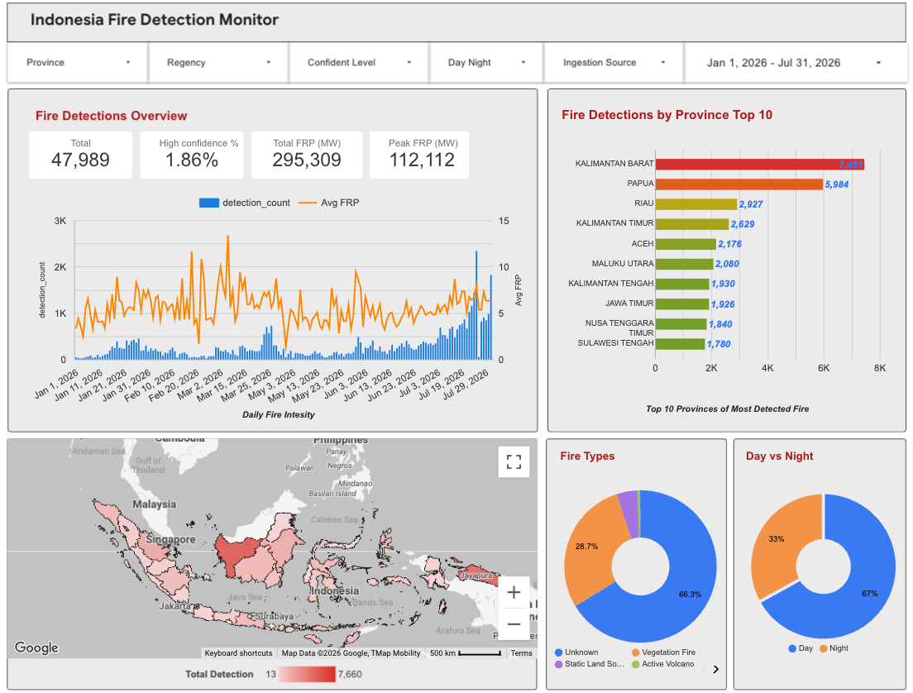
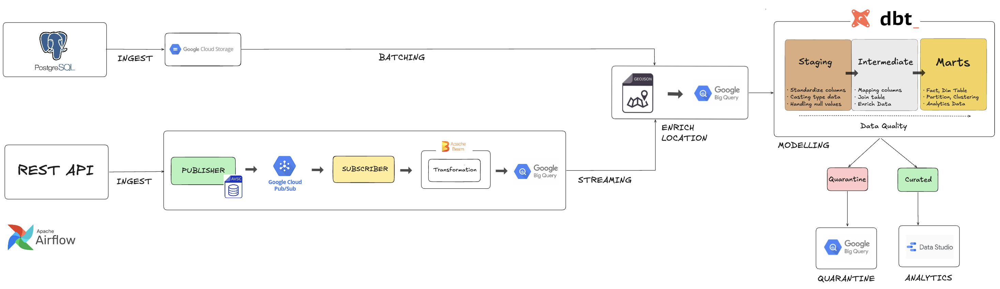
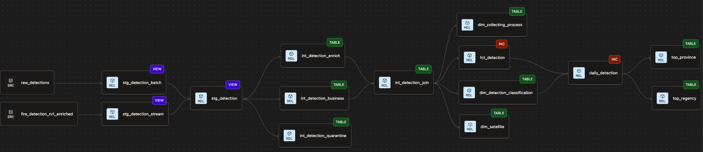
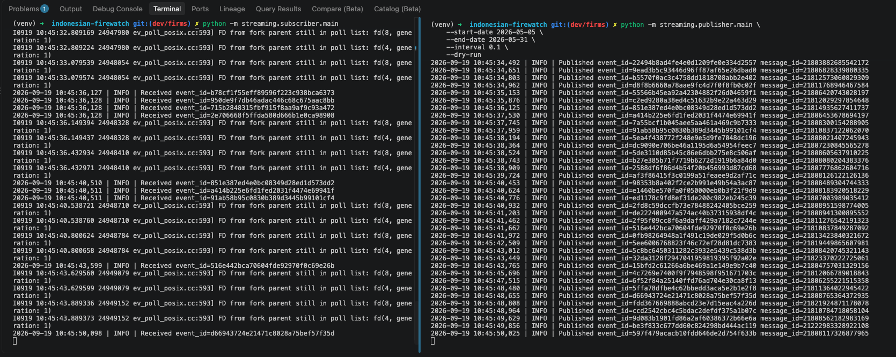
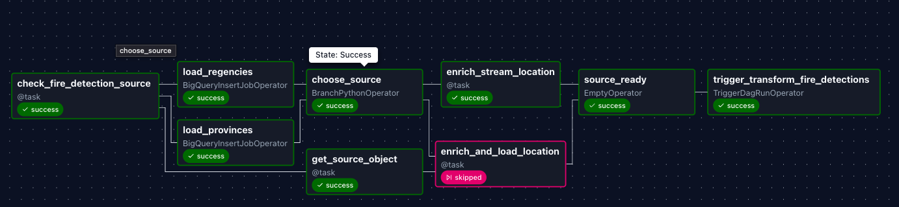
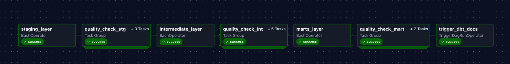
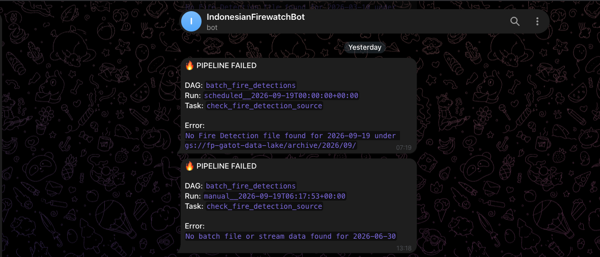
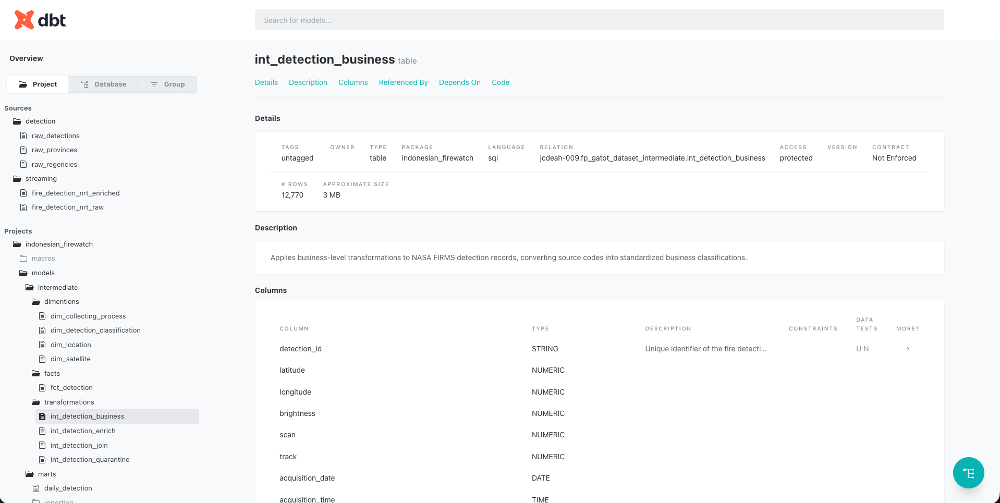

# FireWatch Indonesia

**Monitoring land and forest fire activity in Indonesia through a batch and streaming data pipeline, from raw hotspot detections to analysis-ready datasets.**



---

## Table of Contents

- [Overview](#overview)
- [Problem Statement](#problem-statement)
- [Architecture](#architecture)
- [Tech Stack](#tech-stack)
- [Dataset](#dataset)
- [Batching vs Streaming Strategy](#batching-vs-streaming-strategy)
- [Data Modeling & Lineage](#data-modeling--lineage)
- [Folder Structure](#folder-structure)
- [Setup](#setup)
- [Expected Output](#expected-output)
- [Dashboard](#dashboard)
- [Business Insights](#business-insights)

---

## Overview

FireWatch is a data engineering project that ingests fire hotspot data for Indonesia from the NASA FIRMS API, processes it through both batch and streaming paths, and loads it into BigQuery for transformation and analysis. The pipeline enriches raw hotspot records with province/regency administrative boundaries, applies data quality checks, and models the data with dbt into staging, intermediate, and mart layers. Curated output is visualized in a Data Studio dashboard showing fire type breakdown, hotspot trends over time, and province-level distribution.

The pipeline covers: **ingestion (PostgreSQL → GCS) → warehouse (BigQuery) → transformation (dbt) → data quality gate (quarantine/curated) → analytics (Data Studio)**, orchestrated end-to-end with Apache Airflow.

## Problem Statement

Indonesia experiences recurring land and forest fires, most concentrated during the dry season. Raw fire hotspot data from satellite sources like NASA FIRMS is delivered as high-frequency, non-relational point data (lat/long, brightness, confidence, acquisition time) without built-in aggregation, historical trending, or geographic context.

FireWatch addresses the data engineering side of this problem:

1. Ingesting hotspot data on a recurring basis (batch) and simulating near-real-time ingestion (streaming replay) from the same source
2. Joining raw coordinates with administrative boundary data to make hotspots analyzable at the province/regency level
3. Structuring the data through a layered dbt model (staging → intermediate → marts) with a data quality gate before it reaches the dashboard

## Architecture

Orchestrated end-to-end by **Apache Airflow** (DAGs for ingestion and scheduled dbt runs).



```
        [DAG] Postgres Ingest to GCS                  [DAG] Ingest from REST API
        PostgreSQL ──▶ GCS (Data Lake)                        │
                    │                                         │
                BATCHING                                  STREAMING
                    │                                         │
                    ▼                                         ▼
        GCS ──▶ Enrich Location                Publisher ──▶ Pub/Sub ──▶ Subscriber ──▶ Apache Beam
        Batch GeoJSON ──▶ BigQuery              (Transformation) ──▶ BigQuery ──▶ Enrich Location
                                                                      Stream GeoJSON ──▶ BigQuery
                     │                                        │
                     └───────────────────┬────────────────────┘
                                         ▼
                        [DAG] dbt Transformations
                        Staging ──▶ Intermediate ──▶ Marts
                                         │
                                Data Quality check
                                         │
                            ┌────────────┴────────────┐
                            ▼                          ▼
                        Quarantine                  Curated
                       (BigQuery)                  (BigQuery)
                                                          │
                                                          ▼
                                                      Data Studio
                                                      (Analytics)
```

**Flow explanation:**
1. **PostgreSQL → GCS** — raw records land in Postgres, then get pushed to GCS as the data lake, orchestrated by an Airflow DAG.
2. **Batch path** — GCS data is enriched with location (GeoJSON spatial join) before loading into BigQuery.
3. **Streaming path** — Publisher → Pub/Sub → Subscriber → Apache Beam handles transformation, then location enrichment, before loading into BigQuery.
4. **dbt** — transforms both paths through staging → intermediate → marts (fact/dim tables).
5. **Data quality gate** — validated records go to **Curated**, failed records to **Quarantine**, both in BigQuery.
6. **Analytics** — Curated tables feed Data Studio for dashboarding.

Airflow orchestrates the batch DAGs; Docker containerizes the pipeline services.

## Tech Stack

`PostgreSQL` · `Google Cloud Storage` · `BigQuery` · `dbt` · `Pub/Sub` · `Apache Beam` · `Docker` · `Geopandas` · `SQL` · `Python`

## Dataset

| Source | Description | Frequency | Reference |
|---|---|---|---|
| Fire hotspot data (NASA FIRMS — VIIRS/MODIS) | Lat/long, confidence level, brightness, acquisition date/time | Daily (archive) / near real-time (NRT) | [NASA FIRMS](https://firms.modaps.eosdis.nasa.gov/) |
| Province & regency boundary (GeoJSON) | Polygon geometry for map visualization and spatial join with hotspot coordinates | Static/reference | Processed GeoJSON from [dmxsan/indonesia-admin-boundaries](https://github.com/dmxsan/indonesia-admin-boundaries) (original source: [Badan Informasi Geospasial](https://geoportal.big.go.id/)) |
| Province & regency reference table | Standardized names, codes, and hierarchy (province → kabupaten/kota) for dimension modeling | Static/reference | [Indonesia Province, City, District and Subdistrict — Kaggle](https://www.kaggle.com/datasets/greegtitan/indonesia-province-city-district-and-subdistrict?select=kecamatan.csv) |

> Data sources are used strictly for reference and enrichment; raw datasets are not redistributed in this repository. See linked sources for licensing terms.

Raw data is landed locally (PostgreSQL) before being pushed upstream to the cloud lake/warehouse.

## Batching vs Streaming Strategy

FireWatch uses a **hybrid ingestion strategy**:

| Aspect | Batch | Streaming |
|---|---|---|
| Use case | Historical backfill, daily hotspot aggregates | Simulated near-real-time hotspot ingestion |
| Tools | Local PostgreSQL → GCS → BigQuery load jobs | Pub/Sub (message queue) → Apache Beam (processing) → BigQuery |
| Frequency | Daily batch jobs | Continuous/event-driven |
| Data maturity | Archive — reprocessed & validated by FIRMS, full fire-type classification | NRT — raw, largely unclassified ("Unknown") until reprocessed |
| Rationale | The source data itself is not a live feed — it's pulled from a static/non-streaming API, so batch is the natural fit for historical and daily aggregate reporting | The streaming path replays the same source data record-by-record through Pub/Sub and Beam to demonstrate a real-time ingestion pattern, since the underlying API has no live/push equivalent to consume from directly |

Both paths converge into the same BigQuery tables, so downstream models don't need to distinguish how a record arrived — only that streaming here simulates real-time behavior on top of an inherently batch source, rather than consuming a genuinely live feed.

This mirrors real-world constraints: most **analytical/trend reporting** (province-level trends, monthly comparisons) is well served by batch, while streaming demonstrates how the same source could support faster downstream awareness.

## Data Modeling & Lineage

dbt models follow a layered approach:

- **staging** — 1:1 cleaned views of raw sources (type casting, renaming, dedup)
- **intermediate (silver layer)** — all dimension and fact tables live here: `dim_province`, `dim_satellite`, `fct_detection`, etc., joined against admin boundary/land cover reference data
- **marts** — aggregated, dashboard-ready tables built on top of the silver layer: `daily_province`, `top_province`, `top_regency`



## Folder Structure

```
firewatch/
├── airflow/                 # DAGs orchestrating the batch pipeline
├── dbt/
│   └── models/              # Transformation of data
│       ├── staging/
│       ├── intermediate/
│       └── marts/
├── streaming/
│   ├── publisher/           # pushes replay hotspot events to Pub/Sub
│   └── subscriber/          # Apache Beam pipeline consuming Pub/Sub
├── docs/
│   └── images/              # architecture, lineage, dashboard, demo screenshots
├── scripts/
│   └── enrich_location.py   # maps raw lat/long to province/district
├── Dockerfile
├── docker-compose.yml
└── README.md
```

## Setup

### Prerequisites
- Docker & Docker Compose
- Python 3.10+
- A Google Cloud project with GCS, BigQuery, and Pub/Sub enabled
- `gcloud` CLI installed and authenticated via Application Default Credentials:
```bash
  gcloud auth application-default login
```
  This is required for local services (Airflow, Beam, dbt) to authenticate against GCP without embedding a service account key.

### 1. Clone & Environment Setup

The pipeline lives inside the `Indonesia-firewatch` subdirectory of the root repo.

```bash
git clone https://github.com/gatotbima1104/A-Lazy-Data-Engineer.git
cd A-Lazy-Data-Engineer/Indonesia-firewatch

# create and activate virtual environment
make .venv
source .venv/bin/activate

# install dependencies
pip install -r requirements.txt
pip install -r streaming_requirements.txt
```

Copy the environment template and fill in your own values (GCP project ID, dataset names, Pub/Sub topic/subscription, DB credentials, etc.):

```bash
cp .env.example .env
```

`.env` includes Telegram bot credentials used for failure notifications:
 
```env
TELEGRAM_BOT_TOKEN=your_bot_token
TELEGRAM_CHAT_ID=your_chat_id
```

### 2. Download Reference Data (Boundary GeoJSON)
 
Province boundary GeoJSON files (with district-level detail) are not committed to this repository — they're large (tens of MB per province) and derived from third-party geospatial data. Download them before running the pipeline:
 
```bash
python scripts/download_boundaries.py
```
 
This fetches all province GeoJSON files from [dmxsan/indonesia-admin-boundaries](https://github.com/dmxsan/indonesia-admin-boundaries) (original source: [Badan Informasi Geospasial](https://geoportal.big.go.id/)) and saves them to `data/geojsons/with-districts/`, used by the location enrichment step in both the batch and streaming paths.

### 3. Start Services

```bash
docker compose up -d airflow-init   # one-time Airflow metadata DB init
docker compose up -d                # start all services (Postgres, Airflow, dbt-docs)
```

**Access the UIs:**

| Service | Default URL | OrbStack URL |
|---|---|---|
| Airflow | `localhost:8080` | `https://indonesian-firewatch.airflow.local/` |
| dbt Docs | `localhost:8081` | `http://indonesian-firewatch.dbt-docs.local/` |

### 4. Run the Batch Pipeline

1. In the Airflow UI, add a connection named **`google_cloud_default`** with your GCP credentials (uses the ADC set up in Prerequisites).
2. Trigger the **`ingest_local_pg_to_gcs`** DAG.
   > Assumption: raw FIRMS data is already loaded into the local PostgreSQL instance — this DAG does not pull from the FIRMS API itself.
3. Run the batch DAG, either for a specific date or as a daily scheduled run.

DAG dependency: a successful batch run automatically triggers the **dbt transform DAG**, which runs the staging → intermediate → marts models and regenerates the dbt docs site.

### 5. Run the Streaming Pipeline

**Publisher** — replays historical FIRMS records into Pub/Sub at a configurable interval, simulating a live feed:

```bash
# get data with a single date, one record per interval (You can change the satellite and area of world referring to their FIRMS website)
python -m streaming.publisher.main \
    --date YYYY-MM-DD \
    --key `GET_FROM_NASA_API_MAP` \
    --satellite VIIRS_SNPP_NRT \
    --area "95,-11,141,6" \
    --interval 1 \
    --day-range 1 \
    --dry-run

`--dry-run` prints each record to stdout instead of publishing it to Pub/Sub — useful for validating the replay logic before sending real messages.

**Subscriber** — consumes messages from Pub/Sub and runs the Beam transformation pipeline into BigQuery:

```bash
python -m streaming.subscriber.main
```

## Expected Output

### Streaming


### Batch



### Failed notification


### dbt Documentation


## Dashboard

The dashboard (built on the BigQuery marts) provides:

- **Hotspot trend over time** (daily/monthly/yearly, seasonal pattern)
- **Province/district ranking** by hotspot count and severity
- **Heatmap** of hotspot density across Indonesia


## Business Insights

- **Seasonality is sharp and predictable**: hotspot counts rose dramatically in dry season (Jun–Jul), especially Kalimantan and Riau — supports pre-positioning firefighting resources ahead of peak months rather than reactive deployment.
- **Concentration risk**: a small number of provinces/districts typically account for a disproportionate share of hotspots — targeted monitoring/enforcement in these areas yields higher ROI than uniform nationwide coverage.
- **Peatland correlation**: hotspots on peatland areas tend to burn longer and produce more haze impact per fire — prioritizing peatland zones in early-warning systems can reduce downstream health/economic cost.
- **Near-real-time detection value**: the streaming path enables same-day awareness of new hotspots vs next-day batch reporting, materially shortening response time for authorities.
- **Cost-efficient monitoring**: cloud-native, serverless stack (BigQuery + GCS) keeps infrastructure cost low relative to the scale of environmental/economic risk being monitored — a viable model for government or NGO-scale adoption.

---

*A personal project exploring an end-to-end data engineering workflow, applied to fire hotspot data in Indonesia.*